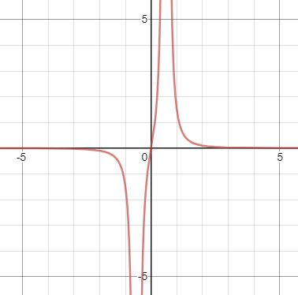

    Arpit Kaushal - 18110024
    Date - 12/06/2020    

>### Table of Contents
<!-- Start Document Outline -->

1. [Problem T1](#problem-t1)
	1. [Description](#description)
	2. [Euler's method](#eulers-method)
	3. [Plot](#plot)
	4. [Observation](#observation)
	5. [MATLAB Code](#matlab-code)
2. [Problem T2](#problem-t2)
	1. [Description](#description-1)
	2. [Chopping with 3 Digits](#chopping-with-3-digits)
	3. [Chopping with 4 Digits](#chopping-with-4-digits)
	4. [Observation](#observation-1)

<!-- End Document Outline -->
## Problem T1

### Description

A coffe cup (initially at 68°C) is kept in a room at 21°C.
We use Euler's method to find the numerical solution (by substituting the derivatives with truncated taylor expansions.)

The differential equation in question is the Newton's Law of Cooling. 
$$ \frac{dT}{dt} = -k(T-T_a) $$
where,
&nbsp; $T =$ temperature of Cup 
&nbsp; $T_a =$ temperature of Surroundings 
&nbsp; $k =$ Cooling Coefficient 
&nbsp; $t =$ time 

### Euler's method
So substituting,  $$\frac{dT}{dt} = \frac{T(i+1) - T(i)}{\Delta t}$$ in the above equation, where $\Delta t =1$ is the step size of time (in minutes). The equation reduces to, $$T(i) = T(i-1) + k(T_a - T(i-1))\Delta t $$

### Plot
To observe the efficiency of Euler's method, the Temperature has also been calculated analytically at different instants.    
@import "assets/tut1_1.jpg" {title="Temperature of Coffee Cup as a Function of Time"} 

### Observation
Euler's method works sufficiently well, even when the step size chosen in our case was  big (10% of total time plotted). 

### MATLAB Code
>*Note: Code also present in the root folder, named as `tut1_1.m `*

@import "assets/tut1_1.m" {class="line-numbers" as="MATLAB"}

## Problem T2

### Description

We're given the derivative of a function,
$$f'(x) = \frac{6x}{(1-3x^2)^2}$$
Tthe above function tends to $\infty$ for $x=\pm\frac{1}{\sqrt3}$, which actually is,  
$x= \pm0.577350269$  

So, when we try to find to $f'(x)$ at $x=0.577$, we realize that we're close to the root of the function, and it basically blows up. Here's what the plot of derivative looks like,   

 

Hence, we expect, $f'(0.577)$ to be really large value. 

### Chopping with 3 Digits

We calculate $f'(0.577)$ by chopping all significant digits except for the first $3$ in all arithmetic operations.

We have,
&nbsp;&nbsp;$x = 0.577$
&nbsp;&nbsp;$x^2=0.332929=0.332 \;\;\;\because \textrm{chopping}$ 
&nbsp;&nbsp;${3x}^{2}=0.996$
&nbsp;&nbsp;${1-3x^2=0.004}$
&nbsp;&nbsp;${6x=3.462=3.46 \;\;\;\because \textrm{chopping}}$

So, 
$$f'(0.557) = \frac{3.46}{0.004^2} = 216,250$$

### Chopping with 4 Digits

We calculate $f'(0.577)$ by chopping all significant digits except for the first $4$ in all arithmetic operations.

We have, 
&nbsp;&nbsp;${x = 0.577}$
&nbsp;&nbsp;${x^2=0.332929=0.3329 \;\;\;\because \textrm{chopping}}$ 
&nbsp;&nbsp;${3x^2=0.9987}$
&nbsp;&nbsp;${1-3x^2=0.0013}$
&nbsp;&nbsp;${6x=3.462}$

So,
$$f'(0.557) = \frac{3.462}{0.0013^2} = 2,048,521$$

### Observation
So, the higher chopping we keep, the tougher it gets to calculate. Operations with chopping ${3}$ digits, made it easier to perform calculations rather than chopping with ${4}$ digits.  

