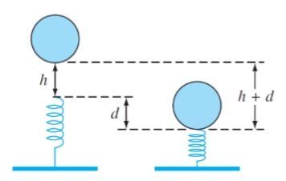
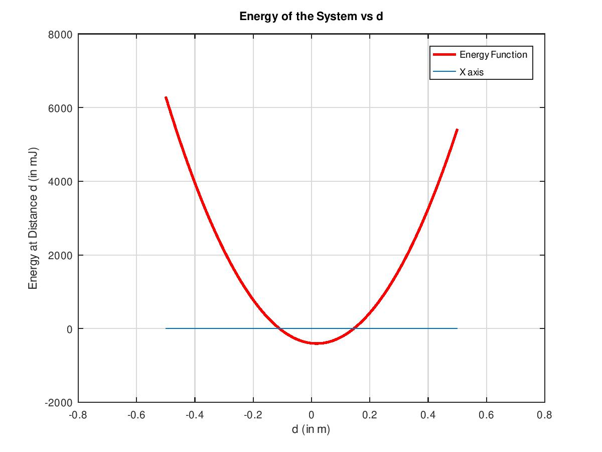
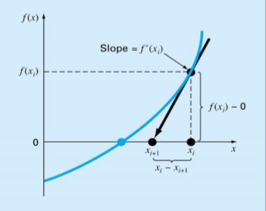

    Arpit Kaushal - 18110024
    Date - 19/06/2020    

>### Table of Contents
1. [Description](#description)
2. [Graphical Method](#graphical-method)
3. [Bisection Method](#bisection-method)
4. [Newton Raphson Method](#newton-raphson-method)
5. [Observations](#observations)
6. [MATLAB Code](#matlab-code)

### Description
The problem describes a non linear spring. A ball is dropped onto the spring from a height ${h \;\text{metres}}$ above it. The spring compresses by a maximum of distance ${d\;\text{metres}}$.

<div align="center">

</div>

The resistive force ${F}$ offered by the spring is non linear in nature. Precisely, $${F = -(k_1d + k_2d^\frac{3}{2})}$$ which results in the energy ${E}$ of system as follows, $${E(d) = \frac{2k_2d^{\frac{5}{2}}}{5} + \frac{1}{2}k_1d^{2} - mgd - mgh }$$ We want to find ${d}$ such that energy of mentioned system is minimum, $i.e.$ set ${E(d)=0}$ and solve for ${d}$. We attempt to do this by three methods.

Loading constants given in the problem.

<!-- @import "assets/tut2_1.m"   {as="MATLAB" line_end=12 line_begin=5} -->


### Graphical Method
We plot the given function for a range of ${d}$ and observe where it cuts the ${X}\text{axis}$. So, we plot $E(d)$. 
<div align="center">

</div>

The plot gives us a good idea of what we're looking for and an intuition of how the energy varies as ${d}$ is varied. From the plot, we find that the function has two roots, one between $-0.2$ and $0$, and another between $0$ and $0.2$ but negative value of ${d}$ doesn't make sense because it is distance (not displacement) so limiting our search between $0$ and $0.2$. But this is just about how far we can get with graphical method, to pin point the optimal value of d, we'll use the following two methods. 

### Bisection Method
We use Bisection Method to aid our search for $d$ which requires us to give it an intial range of $d$ such that 
$$f(d_{lower})*f(d_{upper})<0$$ 
The above equation essentially indicates that the bounds of $d$ should be such that value of function on these points should be on opposite sides of the $X \text{axis}$.  So, now we choose the middle point, $d_{mid} = \frac{d_{lower}+d_{upper}}{2}$ and calculate $f(d_{mid})$, if, 

$$f(d_{mid})*f(d_{lower})>0$$ $$\implies f(d_{mid}) \text{ is on the same side as } f(d_{lower})$$ 
So, we set $d_{lower}$ as $d_{mid}$ and repeat until we reach a decided level of approximate error (here, we've decided that to be $0.001$). Extending the same logic to $d_{upper}$, we get the Bisection Method (called so because we're slicing the intervals in half). 

The above logic in code, 
@import "assets/tut2_1.m"   {as="MATLAB" line_end=61 line_begin=41}

This gives us $d=0.1449$ and $E(d)=0.00057$. 

### Newton Raphson Method
The Newton Raphson method approaches the solution by iteratively finding the $X$ intercept of tangent at a point, and setting that as the current value of independent variable. This works well given the initial guess is not near a maxima or minima (i.e. slope = $0$). 

<div align="center">

</div> <br>

The above logic in code, 
<!-- @import "assets/tut2_1.m"   { as="MATLAB" line_end=77 line_begin=69} -->

This gives us $d=0.1449$ and $E(d)=0.00000$.

### Observations
**Code Output**
```
Bisection Bracekting
d_r =    1.449329376220703e-01
Energy =    5.688103223633334e-04
Iterations      18

Newton Raphson
d_g =    1.449328482703562e-01
Energy =    1.627199708309490e-09
Iterations      4
```
The above snippet displays the result of using *Bisecting* and *Newton Raphson* Method, additionally it gives us insight into the efficiency and accuracy involved with choosing either methods. 
<br>Clearly **Newton Raphson** takes a lead here, with precision of more than $8$ decimal points in just 4 iterations. 
While **Bisection** only achieves a value of $d$ to a precision of $4$ decimals, as well as took more iterations ($18$). 
<br>But it's important to note here that both of the above methods depend on the **Graphical Method** for ***good*** initial guesses of values of $d$, without which these methods may diverge indefinitely. Thus, it's an essential component of analysis, additionally it makes it easier to draw annalogies relevant to the problem by giving a bird's eye view of the function.         

### MATLAB Code
**Function of System's Energy Definition**
@import "assets/Eng.m"  {as="MATLAB"} 
**Function's First Derivative**
@import "assets/EngDash.m"  {as="MATLAB"}
**Main Script** 
@import "assets/tut2_1.m"   {class="line-numbers" as="MATLAB"}
